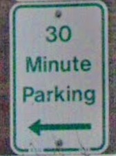
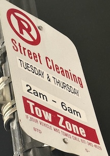
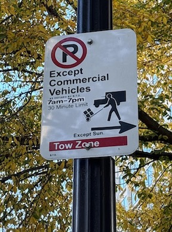
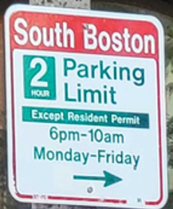
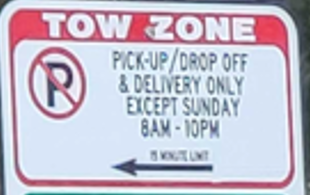
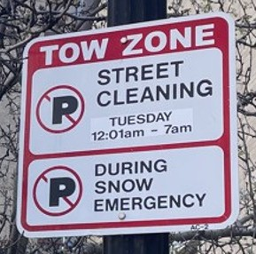
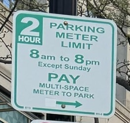
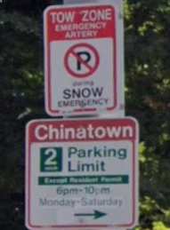
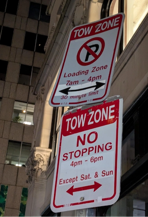

# Specification by Example

The best way to understand CDS is through evaluation of a series of increasingly complex
examples. Below, we begin with single-sign examples, describing the policy or policies
required to represent regulations on each sign. These single-sign examples do not
include the catchall policy, which will be added when sign-specific policies are
applied to a curb zone.

After evaluating individual signs, we consider examples of sign groups - representing
a group of signs that are applicable to a specific zone. When evaluating sign groups,
we will consider the complete set of policies applied to a zone with a particular set
of parking signs and policies, including the catchall policy.

## Single Sign Examples

### 30-Minute Parking

This sign represents a 30-minute parking limit, applied at all times. The limit is applied to
all user classes and the sign is represented by a policy with the following rule:

- Parking allowed, 30 minute max stay.



??? tip "Detailed Policy JSON"
    ```json
    {
      "name": "Parking allowed, 30 minute max stay",
      "priority": 90,
      "rules": [
        {
          "activity": "parking",
          "max_stay": 30,
          "max_stay_unit": "minute"
        }
      ]
    }
    ```

### Street Cleaning Tuesday and Thursday

This sign prohibits parking on Tuesday and Thursday between 2 AM and 6 AM for
street cleaning. It can be represented by a single policy with a single
rule:

- No Parking, Tue & Thur from 2 AM to 6 AM



??? tip "Detailed Policy JSON"
    ```json
    {
      "name": "No Parking, Tue & Thur from 2 AM to 6 AM",
      "priority": 30,
      "rules": [
        {
          "activity": "no parking"
        }
      ],
      "time_spans": [
        {
          "days_of_week": ["tue", "thu"],
          "time_of_day_start": "02:00",
          "time_of_day_end": "06:00"
        }
      ]
    }
    ```


### Commercial Vehicle Parking

This sign prohibits parking except for commercial vehicles, which is limited
to 30 minutes. This sign can be represented by one policy with a single rule:

- Parking allowed for commercial vehicles, 7 AM to 7 PM, all days except Sunday.



??? tip "Detailed Policy JSON"
    ```json
    {
      "name":"Parking allowed for commercial vehicles, 7 AM to 7 PM, all days except Sunday",
      "priority": 40,
      "rules": [
        {
          "activity": "parking",
          "max_stay": 30,
          "max_stay_unit": "minute",
          "user_classes": ["commercial_vehicle"]
        }
      ],
      "time_spans": [
        {
          "days_of_week": [
            "mon",
            "tue",
            "wed",
            "thu",
            "fri",
            "sat"
          ],
          "time_of_day_start": "07:00",
          "time_of_day_end": "19:00"
        }
      ]
    }
    ```

!!! warning "Implied Prohibition"
    This policy example relies on implied prohibition. Allowance of parking for
    commercial vehicles during the designated `time_spans` implies that other vehicles
    cannot park in zones covered by this sign.

### 2-Hour Parking with Resident Exception

This next example addresses a 2-hour limit on parking, where area residents displaying 
a residential parking permit are not subject to the time limitation. This sign can be 
represented by one policy with a single rule:

- 2-hour limit except residents, 6 PM to 10 AM Mon-Fri




??? tip "Detailed Policy JSON"
    ```json
    {
      "name": "2-hour limit except residents, 6 PM to 10 AM Mon-Fri",
      "priority": 40,
      "rules": [
        { "activity": "parking", "user_classes": ["resident_permit"] },

        {
          "activity": "parking",
          "max_stay": 2,
          "max_stay_unit": "hour",
          "user_classes_except": ["resident_permit"]
        }
      ],
      "time_spans": [
        {
          "time_of_day_start": "18:00",
          "time_of_day_end": "10:00",
          "days_of_week": ["mon", "tue", "wed", "thu", "fri"]
        }
      ]
    }
    ```

### Pick-up/Drop Off and Delivery

The sign below limits curb activities to pick-up/drop off and deliveries. For the Boston 
implementation of CDS, we are using the assertion that the activity `loading` allows loading 
and unloading of both people and goods. With this assumption, this sign can be represented
by this simple policy with one rule:

- Loading allowed, max stay 15 minutes, 8 AM to 10 PM except Sunday.



??? tip "Detailed Policy JSON"
    ```json
    {
      "name": "Loading allowed, max stay 15 minutes, 8 AM to 10 PM except Sunday",
      "priority": 80,
      "rules": [
        {
          "activity": "loading",
          "max_stay": 15,
          "max_stay_unit": "minute"
        }
      ],
      "time_spans": [
        {
          "time_of_day_start": "08:00",
          "time_of_day_end": "22:00",
          "days_of_week": ["mon", "tue", "wed", "thu", "fri", "sat"]
        }
      ]
    }
    ```

!!! warning "Implied Prohibition"
    This policy example relies on implied prohibition. Allowance of loading 
    during the designated `time_spans` implies that vehicles
    cannot perform other activities such as park.

## Zone Examples

Each zone served by the CDS API will contain one or more policies that represent 
regulations on a particular curb segment. Examples of complete policy lists follow.

### Snow Zone with Street Cleaning

This pair of signs, posted as a single physical sign, can represent the complete
set of rules for a curb zone where parking is otherwise allowed. Because these
two regulations are interpreted as two separate signs, this example uses two
separate policies, plus the unrestricted catchall. The policy set for
this sign is as follows, listed with the most important policy first:

1. No parking during snow emergencies.
2. No parking on Tuesdays from 12:01 AM to 7 AM.
3. Unrestricted parking.



??? tip "Detailed Policy JSON"
    ```json
    [
      {
        "name": "No parking during snow emergencies",
        "priority": 30,
        "rules": [{ "activity": "no parking" }],
        "time_spans": [{"designated_period": "snow emergency"}]
      },
      {
        "name": "No parking on Tuesdays from 12:01 AM to 7 AM",
        "priority": 35,
        "rules": [{ "activity": "no parking" }],
        "time_spans": [
          {
            "time_of_day_start": "00:01",
            "time_of_day_end": "07:00",
            "days_of_week": ["tue"]
          }
        ]
      },
      {
        "name": "Unrestricted parking",
        "priority": 99,
        "rules": [{ "activity": "parking" }]
      }
    ]
    ```

### Metered Parking, with snow zone and street cleaning

In many cases, snow zone and street cleaning signs are paired with other regulations 
such as 2-hour metered parking. The policy combination would be represented by the
following policies:

1. No parking during snow emergencies.
2. No parking on Tuesdays from 12:01 AM to 7 AM.
3. 2-hour Parking, 8 AM to 8 PM Except Sunday. 
4. Unrestricted parking.

  


??? tip "Detailed Policy JSON"
    ```json
    [
      {
        "name": "No parking during snow emergencies",
        "priority": 30,
        "rules": [{ "activity": "no parking" }],
        "time_spans": [{"designated_period": "snow emergency"}]
      },
      {
        "name": "No parking on Tuesdays from 12:01 AM to 7 AM",
        "priority": 35,
        "rules": [{ "activity": "no parking" }],
        "time_spans": [
          {
            "time_of_day_start": "00:01",
            "time_of_day_end": "07:00",
            "days_of_week": ["tue"]
          }
        ]
      },
      {
        "name": "2-hour Parking, 8 AM to 8 PM Except Sunday.",
        "priority": 80,
        "rules": [{ "activity": "parking", "rate": [{ "rate": 200, "rate_unit": "hour" }] }],
        "time_spans": [
          {
            "time_of_day_start": "08:00",
            "time_of_day_end": "20:00",
            "days_of_week": ["mon", "tue", "wed", "thu", "fri", "sat"]
          }
        ]
      },
      {
        "name": "Unrestricted parking",
        "priority": 99,
        "rules": [{ "activity": "parking" }]
      }
    ]
    ```

### Resident Parking, with snow zone

This next example addresses a 2-hour limit on parking, where area residents displaying 
a residential parking permit are not subject to the time limitation. This example also 
includes a snow emergency parking restriction.

1. No parking during snow emergencies.
2. 2-hour limit except residents, 6 PM to 10 PM Mon-Sat
3. Unrestricted parking




??? tip "Detailed Policy JSON"
    ```json
    [
      {
        "name": "No parking during snow emergencies",
        "priority": 30,
        "rules": [{ "activity": "no parking" }],
        "time_spans": [{"designated_period": "snow emergency"}]
      },
      {
        "name": "2-hour limit except residents, 6 PM to 10 PM Mon-Sat",
        "priority": 40,
        "rules": [
          { "activity": "parking", "user_classes": ["resident_permit"] },

          {
            "activity": "parking",
            "max_stay": 2,
            "max_stay_unit": "hour",
            "user_classes_except": ["resident_permit"]
          }
        ],
        "time_spans": [
          {
            "time_of_day_start": "18:00",
            "time_of_day_end": "22:00",
            "days_of_week": ["mon", "tue", "wed", "thu", "fri", "sat"]
          }
        ]
      },
      {
        "name": "Unrestricted parking",
        "priority": 99,
        "rules": [{ "activity": "parking" }]
      }
    ]
    ```


### Loading Zone and No Stopping

This pair of signs designates a loading zone for the majority of the day, with 
no stopping allowed for 2 hours after the loading period ends. Unrestricted 
parking is allowed out of the designated times. It can be represented by the policies
below.

1. No stopping for any vehicles from 4 PM to 6 PM, except Saturday and Sunday.
2. Loading allowed for all vehicles from 7 AM to 4 PM, 30 minute max.
3. Unrestricted parking.




??? tip "Detailed Policy JSON"
    ```json
    [
      {
        "name": "No stopping for any vehicles from 4 PM to 6 PM, except Saturday and Sunday",
        "priority": 30,
        "rules": [{ "activity": "no stopping" }],

        "time_spans": [
          {
            "time_of_day_start": "16:00",
            "time_of_day_end": "18:00",
            "days_of_week": ["mon", "tue", "wed", "thu", "fri"]
          }
        ]
      },
      {
        "name": "Loading allowed for all vehicles from 7 AM to 4 PM, 30 minute max",
        "priority": 80,
        "rules": [
          { "activity": "loading", "max_stay": 30, "max_stay_unit": "minute" }
        ],

        "time_spans": [
          {
            "time_of_day_start": "07:00",
            "time_of_day_end": "16:00"
          }
        ]
      },
      {
        "name": "Unrestricted parking",
        "priority": 99,
        "rules": [{ "activity": "parking" }]
      }
    ]
    ```

!!! warning "Implied Prohibition"
    This policy example relies on implied prohibition. Allowance of loading 
    during the designated `time_spans` implies that vehicles
    cannot perform other activities such as park.